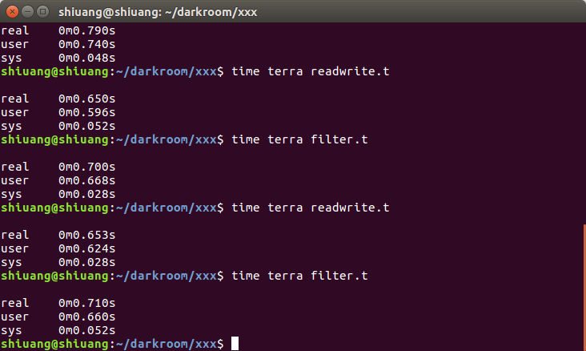
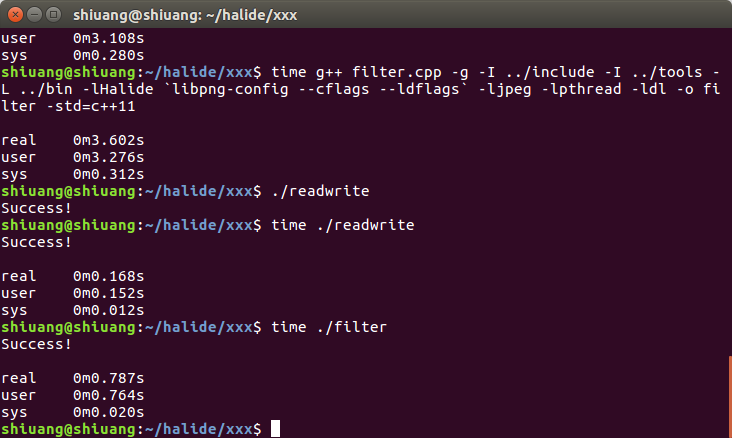

# comparison to Halide

### 概述
Halide也是用于图像处理的领域专用语言。Halide程序由两部分组成，一部分是算法，另一部分是调度（scheduling）。算法部分决定了哪些要被计算，而调度部分描述了以何种顺序执行操作。不同的调度有着不同的实际表现，因此（Halide的开发者）设计了一个新的方法用于自动找到好的规划。从这一点上来说，Darkroom的代价相对更小。尽管对于Darkroom来说，模板的尺寸必须在编译时是已知的，但就结果而言，在CPU或其它高效定制硬件上，确定性规划的Darkroom和自动规划方法规划的Halide代码相比有着一定的竞争力。

### 构建依赖
Darkroom是基于terra的，而Halide是基于C++的，两者都依赖于llvm产生各种平台上的代码，以求得到较高的效率。

### 图像处理的领域专用语言
两者都是用于图像处理的领域专用语言，目标都是用高级语言产生在各个硬件平台上能高效执行的代码。

### 并行与流水线
Darkroom主要着眼于流水线与缓冲的实现和优化，没有对并行计算做具体的讨论和限制；而Halide的灵活性则强得多，因为它有对算法以何种顺序执行操作的调度部分，在这部分中，可以通过各种方式来平衡工作重复度、代码局部性和并行性来得到想要的效果，但这同时也为Halide带来如何规划平衡的问题。

### map&reduce
两者都有map&reduce的语法用于更简单的描述模板。

### 图像金字塔
Darkroom暂时无法处理图像金字塔，Halide可以。

### 测试比较
darkroom：

	1. 用terra解释执行
	2. readwrite.t : 直接读入图片并写回文件
	3. filter.t : 读入图片后进行3×3的均值滤波再把结果写回文件

halide：

	1. 用g++编译后执行
	2. readwrite.cpp : 直接读入图片并写回文件夹
	3. filter.cpp : 读入图片后进行3×3的均值滤波再把结果写回文件(规划部分的代码没有写，效果可能和没有优化的代码一样)

不同点：目前两者处理的支持的图片格式不一样，但图片内容一样，影响应该不大。

比较结果：

	1. halide的编译时间比较长（在用g++编译来执行的情况下）
	2. darkroom对图片文件的读写效率比halide低很多
	3. darkroom实现的均值滤波效率较高，halide由于没有编写合适的规划代码，效率较低
	4. 另外halide可能对边界的处理不是很智能，按这里的写法会导致输出图像的长宽各减少2个像素，而不按这种写法会报错（可能是对halide的理解不够深入）