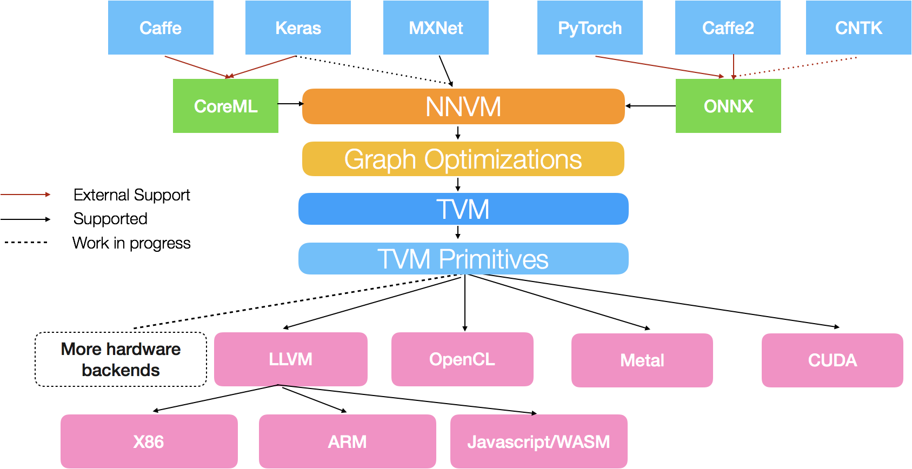

NNVM是一个开源的深度学习编译器，它为深度学习系统提供可重复使用的计算图优化和编译。



NNVM利用operator的高层信息去优化计算图，完成了从symbol描述的网络到graph描述的符号计算图的生成和优化工作。将不同的深度学习框架统一成计算图表示，经过优化后交给TVM处理，最终编译成硬件后端能够处理的计算。

NNVM编译器采取与现有的深度学习框架不同的方法，将图优化与部署运行时打包在一起。 将优化与实际的部署运行时分离开来，这种方法提供了大量的优化，但仍然保持运行时轻量级。

 NNVM 编译器提出的基本思想与 LLVM 相当接近，目的也是为了给新出现的框架和硬件提供友好的支持。

在 NNVM 中，前端作为不同的深度学习框架的计算图，这些计算图输入给 NNVM 后，将计算图做统一的转换，再根据目标资源（如 CPU，GPU，ARM 等）的特性对计算图做出必要的操作和优化，最后输出到对应计算资源的硬件代码。

NNVM 编译器中主要有两个部件组成，一个是 NNVM ，一个是 TVM。

NNVM 通过将来自不同的框架的工作负载表示成标准的计算图，然后将这些图翻译成执行图。 NNVM 同时还搭配了称作 Pass 的例程，以操作这些计算图。这些例程要么往图上添加新的属性以执行他们，要么调整图以提高效率

TVM 起源于 Halide，用于在计算图中实现算子，并对其进行优化用于目标后端硬件。 和 NNVM 不同，它提供了一个硬件无关的、领域特定的语言以在张量指标级上简化算子实现。TVM 还提供了调度原语比如多线程、 平铺和缓存以优化计算，从而充分利用硬件资源。这些调度是硬件相关的，要么用手工编写，要么也可以自动搜索优化模式。

### 优化数据库（optdb）

Theano输出一个名为optdb的符号，作为一种有序的优化数据库。当进行新的优化时，必须将其插入数据库中的适当位置。此外，可以在数据库中为每个优化提供一组可用作筛选基础的标记。

#### optdb结构

optdb包括以下Optimizers和sub-DB

| Order | Name                | Description                  |
| ----- | ------------------- | ---------------------------- |
| 0     | merge1              | First merge operation        |
| 1     | canonicalize        | Simplify the graph           |
| 2     | specialize          | Add specialized operations   |
| 49    | merge2              | Second merge operation       |
| 49.5  | add_destroy_handler | Enable inplace optimizations |
| 100   | merge3              | Third merge operation        |

### 具体的优化-以Theano为例

```
Optimizer Profile
-----------------
 SeqOptimizer  OPT_FAST_RUN  time 1.152s for 123/50 nodes before/after optimization
   0.028s for fgraph.validate()
   0.131s for callback
   time      - (name, class, index) - validate time
   0.751816s - ('canonicalize', 'EquilibriumOptimizer', 4) - 0.004s
     EquilibriumOptimizer      canonicalize
       time 0.751s for 14 passes
       nb nodes (start, end,  max) 108 81 117
       time io_toposort 0.029s
       time in local optimizers 0.687s
       time in global optimizers 0.010s
        0 - 0.050s 27 (0.000s in global opts, 0.002s io_toposort) - 108 nodes - ('local_dimshuffle_lift', 9) ('local_upcast_elemwise_constant_inputs', 5) ('local_shape_to_shape_i', 3) ('local_fill_sink', 3) ('local_fill_to_alloc', 2) ...
        1 - 0.288s 26 (0.002s in global opts, 0.002s io_toposort) - 117 nodes - ('local_dimshuffle_lift', 8) ('local_fill_sink', 4) ('constant_folding', 4) ('local_useless_elemwise', 3) ('local_subtensor_make_vector', 3) ...
        2 - 0.044s 13 (0.002s in global opts, 0.003s io_toposort) - 96 nodes - ('constant_folding', 4) ('local_dimshuffle_lift', 3) ('local_fill_sink', 3) ('local_useless_elemwise', 1) ('local_fill_to_alloc', 1) ...
        3 - 0.045s 11 (0.000s in global opts, 0.002s io_toposort) - 91 nodes - ('constant_folding', 3) ('local_fill_to_alloc', 2) ('local_dimshuffle_lift', 2) ('local_mul_canonizer', 2) ('MergeOptimizer', 1) ...
        4 - 0.035s 8 (0.002s in global opts, 0.002s io_toposort) - 93 nodes - ('local_fill_sink', 3) ('local_dimshuffle_lift', 2) ('local_fill_to_alloc', 1) ('MergeOptimizer', 1) ('constant_folding', 1)
        5 - 0.035s 6 (0.000s in global opts, 0.002s io_toposort) - 88 nodes - ('local_fill_sink', 2) ('local_dimshuffle_lift', 2) ('local_fill_to_alloc', 1) ('local_mul_canonizer', 1)
        6 - 0.038s 10 (0.001s in global opts, 0.002s io_toposort) - 95 nodes - ('local_fill_sink', 3) ('local_dimshuffle_lift', 3) ('constant_folding', 2) ('local_fill_to_alloc', 1) ('MergeOptimizer', 1)
        7 - 0.032s 5 (0.001s in global opts, 0.002s io_toposort) - 91 nodes - ('local_fill_sink', 3) ('MergeOptimizer', 1) ('local_dimshuffle_lift', 1)
        8 - 0.034s 5 (0.000s in global opts, 0.002s io_toposort) - 92 nodes - ('local_fill_sink', 3) ('MergeOptimizer', 1) ('local_greedy_distributor', 1)
        9 - 0.031s 6 (0.001s in global opts, 0.002s io_toposort) - 90 nodes - ('local_fill_sink', 2) ('local_fill_to_alloc', 1) ('MergeOptimizer', 1) ('local_dimshuffle_lift', 1) ('local_greedy_distributor', 1)
       10 - 0.032s 5 (0.000s in global opts, 0.002s io_toposort) - 89 nodes - ('local_dimshuffle_lift', 2) ('local_fill_to_alloc', 1) ('MergeOptimizer', 1) ('local_fill_sink', 1)
       11 - 0.030s 5 (0.000s in global opts, 0.002s io_toposort) - 88 nodes - ('local_dimshuffle_lift', 2) ('local_fill_to_alloc', 1) ('MergeOptimizer', 1) ('constant_folding', 1)
       12 - 0.026s 1 (0.000s in global opts, 0.003s io_toposort) - 81 nodes - ('MergeOptimizer', 1)
       13 - 0.031s 0 (0.000s in global opts, 0.003s io_toposort) - 81 nodes -
       times - times applied - nb node created - name:
       0.263s - 15 - 0 - constant_folding
       0.096s - 2 - 14 - local_greedy_distributor
       0.066s - 4 - 19 - local_mul_canonizer
       0.046s - 28 - 57 - local_fill_sink
       0.042s - 35 - 78 - local_dimshuffle_lift
       0.018s - 5 - 15 - local_upcast_elemwise_constant_inputs
       0.010s - 11 - 4 - MergeOptimizer
       0.009s - 4 - 0 - local_useless_elemwise
       0.005s - 11 - 2 - local_fill_to_alloc
       0.004s - 3 - 6 - local_neg_to_mul
       0.002s - 1 - 3 - local_lift_transpose_through_dot
       0.002s - 3 - 4 - local_shape_to_shape_i
       0.002s - 2 - 4 - local_subtensor_lift
       0.001s - 3 - 0 - local_subtensor_make_vector
       0.001s - 1 - 1 - local_sum_all_to_none
       0.131s - in 62 optimization that where not used (display only those with a runtime > 0)
         0.050s - local_add_canonizer
         0.018s - local_mul_zero
         0.016s - local_one_minus_erf
         0.010s - local_func_inv
         0.006s - local_0_dot_x
         0.005s - local_track_shape_i
         0.004s - local_mul_switch_sink
         0.004s - local_fill_cut
         0.004s - local_one_minus_erf2
         0.003s - local_remove_switch_const_cond
         0.003s - local_cast_cast
         0.002s - local_IncSubtensor_serialize
         0.001s - local_sum_div_dimshuffle
         0.001s - local_div_switch_sink
         0.001s - local_dimshuffle_no_inplace_at_canonicalize
         0.001s - local_cut_useless_reduce
         0.001s - local_reduce_join
         0.000s - local_sum_sum
         0.000s - local_useless_alloc
         0.000s - local_reshape_chain
         0.000s - local_useless_subtensor
         0.000s - local_reshape_lift
         0.000s - local_flatten_lift
         0.000s - local_useless_slice
         0.000s - local_subtensor_of_alloc
         0.000s - local_subtensor_of_dot
         0.000s - local_subtensor_merge
   0.101733s - ('elemwise_fusion', 'SeqOptimizer', 13) - 0.000s
     SeqOptimizer      elemwise_fusion  time 0.102s for 78/50 nodes before/after optimization
       0.000s for fgraph.validate()
       0.004s for callback
       0.095307s - ('composite_elemwise_fusion', 'FusionOptimizer', 1) - 0.000s
         FusionOptimizer
          nb_iter 3
          nb_replacement 10
          nb_inconsistency_replace 0
          validate_time 0.000249624252319
          callback_time 0.00316381454468
          time_toposort 0.00375390052795
       0.006412s - ('local_add_mul_fusion', 'FusionOptimizer', 0) - 0.000s
         FusionOptimizer
          nb_iter 2
          nb_replacement 3
          nb_inconsistency_replace 0
          validate_time 6.43730163574e-05
          callback_time 0.000783205032349
          time_toposort 0.0035240650177
   0.090089s - ('inplace_elemwise_optimizer', 'FromFunctionOptimizer', 30) - 0.019s
   0.048993s - ('BlasOpt', 'SeqOptimizer', 8) - 0.000s
     SeqOptimizer      BlasOpt  time 0.049s for 81/80 nodes before/after optimization
       0.000s for fgraph.validate()
       0.003s for callback
       0.035997s - ('gemm_optimizer', 'GemmOptimizer', 1) - 0.000s
         GemmOptimizer
          nb_iter 2
          nb_replacement 2
          nb_replacement_didn_t_remove 0
          nb_inconsistency_make 0
          nb_inconsistency_replace 0
          time_canonicalize 0.00720071792603
          time_factor_can 9.05990600586e-06
          time_factor_list 0.00128507614136
          time_toposort 0.00311398506165
          validate_time 4.60147857666e-05
          callback_time 0.00174236297607
       0.004569s - ('local_dot_to_dot22', 'TopoOptimizer', 0) - 0.000s
         TopoOptimizer
           nb_node (start, end, changed) (81, 81, 5)
           init io_toposort 0.00139284133911
           loop time 0.00312399864197
           callback_time 0.00172805786133
       0.002283s - ('local_dot22_to_dot22scalar', 'TopoOptimizer', 2) - 0.000s
         TopoOptimizer
           nb_node (start, end, changed) (80, 80, 0)
           init io_toposort 0.00171804428101
           loop time 0.000502109527588
           callback_time 0.0
       0.002257s - ('local_gemm_to_gemv', 'EquilibriumOptimizer', 3) - 0.000s
         EquilibriumOptimizer          local_gemm_to_gemv
           time 0.002s for 1 passes
           nb nodes (start, end,  max) 80 80 80
           time io_toposort 0.001s
           time in local optimizers 0.000s
           time in global optimizers 0.000s
            0 - 0.002s 0 (0.000s in global opts, 0.001s io_toposort) - 80 nodes -
       0.002227s - ('use_c_blas', 'TopoOptimizer', 4) - 0.000s
         TopoOptimizer
           nb_node (start, end, changed) (80, 80, 0)
           init io_toposort 0.0014750957489
           loop time 0.00068998336792
           callback_time 0.0
       0.001632s - ('use_scipy_ger', 'TopoOptimizer', 5) - 0.000s
         TopoOptimizer
           nb_node (start, end, changed) (80, 80, 0)
           init io_toposort 0.00138401985168
           loop time 0.000202178955078
           callback_time 0.0
   0.031740s - ('specialize', 'EquilibriumOptimizer', 9) - 0.000s
     EquilibriumOptimizer      specialize
       time 0.031s for 2 passes
       nb nodes (start, end,  max) 80 78 80
       time io_toposort 0.003s
       time in local optimizers 0.022s
       time in global optimizers 0.004s
        0 - 0.017s 6 (0.002s in global opts, 0.001s io_toposort) - 80 nodes - ('constant_folding', 2) ('local_mul_to_sqr', 1) ('local_elemwise_alloc', 1) ('local_div_to_inv', 1) ('local_mul_specialize', 1)
        1 - 0.014s 0 (0.002s in global opts, 0.001s io_toposort) - 78 nodes -
       times - times applied - nb node created - name:
       0.003s - 1 - 1 - local_mul_specialize
       0.002s - 1 - 2 - local_elemwise_alloc
       0.002s - 2 - 0 - constant_folding
       0.001s - 1 - 1 - local_div_to_inv
       0.001s - 1 - 1 - local_mul_to_sqr
       0.016s - in 69 optimization that where not used (display only those with a runtime > 0)
         0.004s - crossentropy_to_crossentropy_with_softmax_with_bias
         0.002s - local_one_minus_erf
         0.002s - Elemwise{sub,no_inplace}(z, Elemwise{mul,no_inplace}(alpha subject to <function <lambda> at 0x7f475e4da050>, SparseDot(x, y))) -> Usmm{no_inplace}(Elemwise{neg,no_inplace}(alpha), x, y, z)
         0.002s - local_add_specialize
         0.001s - local_func_inv
         0.001s - local_useless_elemwise
         0.001s - local_abs_merge
         0.001s - local_track_shape_i
         0.000s - local_one_minus_erf2
         0.000s - local_sum_mul_by_scalar
         0.000s - local_elemwise_sub_zeros
         0.000s - local_cast_cast
         0.000s - local_alloc_unary
         0.000s - Elemwise{log,no_inplace}(Softmax(x)) -> <function make_out_pattern at 0x7f47619a8410>(x)
         0.000s - local_sum_div_dimshuffle
         0.000s - local_sum_alloc
         0.000s - local_dimshuffle_lift
         0.000s - local_reduce_broadcastable
         0.000s - local_grad_log_erfc_neg
         0.000s - local_advanced_indexing_crossentropy_onehot
         0.000s - local_log_erfc
         0.000s - local_log1p
         0.000s - local_log_add
         0.000s - local_useless_alloc
         0.000s - local_neg_neg
         0.000s - local_neg_div_neg
...

```

优化按层次结构进行组织。 在顶层，有一个SeqOptimizer（序列优化器）。 它包含其他优化器，并按照指定的顺序应用它们。 那些子优化器可以是其他类型，但都是全局优化器。

层次结构中的每个优化器都将打印一些关于其自身的统计信息。 它打印的信息取决于优化器的类型


### 交流

1. 什么是nnvm？它提供什么样的功能？
  答：NNVM是一个开源的深度学习编译器，它可以将前端框架的工作直接编译到硬件后端。

2. nnvm工作的大体流程是什么样的？
  答：前端将不同的神经网络框架写成的程序统一成计算图表示，然后进行经典的图优化，之后调用tvm进行进一步的优化。最后根据不同的硬件生成对应的代码。

3. 能具体说明用了哪些优化的手段吗？
  答： 主要是针对循环cache命中率的优化，向量化和并行化。

  循环cache命中率的提高可以通过循环平铺，让访问空间尽量连续。

  向量化是基于连续访存时的一种优化手段，通过cpu硬件指令，单指令多数据同时算，速度比一个个算快很多。

  gpu有共享缓存可以被所有线程块访问，可以避免多次读入，而且速度很快。这个共享缓存是用户自己维护的，所以 tvm 在这上面给了这种优化方案，但具体因为矩阵有时候会很大，不能全放进去，所以会每次只塞一部分进去。


### 思考 NNVM和Darkroom有什么关系？

1. 二者都有作为编译器的一面，通过对比可以发现编译器工程上的一些共性特征。比如要面对不同的前端或后端，这时会采用中间表示，并且在中间表示上会进行独立于机器的优化，在直面硬件时根据不同的硬件进一步优化。
2. 二者的优化手段类似。一方面是经典的编译优化手段，比如常量传播、公共子表达式外提、死代码删除；另一方面是二者都之间面对硬件，所以会细致的考察Cache利用率和向量化等问题。
3. NNVM侧重于深度神经网络，而Darkroom则是图像处理领域的专用语言，二者在应用上交集取决于两个领域的重叠程度，但是在编译器这个领域却又很多相似之处。在比较中学习使得我们能够发现不变的东西。
