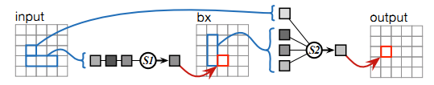
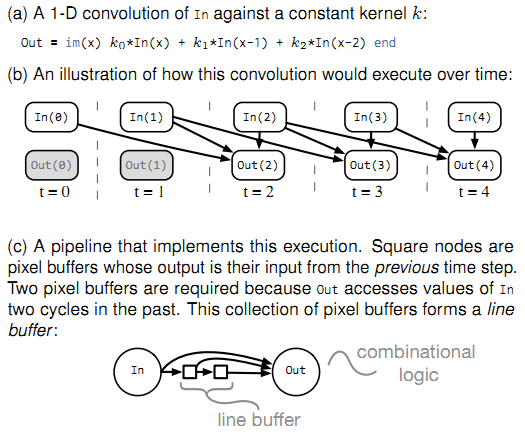
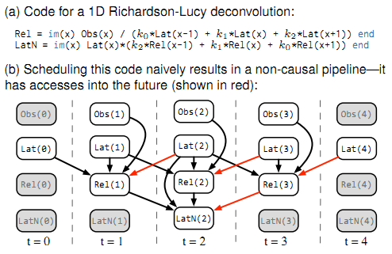
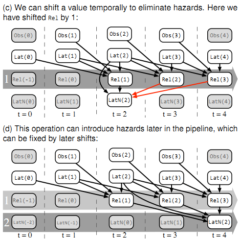
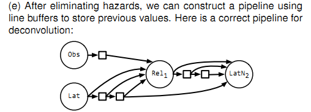

# Darkroom Research Report

## 1.相关工作
### 1.1 Halide
一种图像处理语言，把算法和调度语言分开。算法部分描述计算的内容，调度部分描述计算的次序。autotuner用来自动发现最佳的调度策略。
与Halide相比，Darkroom的描述能力较弱，窗口大小必须在编译时就知道。但在CPU上编译速度比较快，在自定义硬件上也比较高效。
Stencil computation
之前的一些物理模拟中也用到了窗口计算的方法，Darkroom借鉴了其中一些方法，但重点在调度多窗口计算。

### 1.2 OpenCV

一个C语言库，用于处理图像。有一部分已经可以通过高级综合工具在FPGA上实现。但由于是一个依赖具体语言实现的库，不能对图像处理过程中的内存使用进行优化。

### 1.3 SDF

无环数据流图，每个结点从输入中消费M个值，从输出中生产N个值。所有消费生产速率都可以在编译时得知。但在有限内存中调度是NP-完全问题。
而Darkroom则可以在多项式时间内解决，而且考虑到了图片的2D特性。

### 1.4 Systolic Arrays and DSPs

ISP和脉动阵列（systolic arrays）有相似之处。脉动阵列由多个简单处理器阵列组成，每个处理器可以和阵列中的邻居之间互联。
DSP是通用处理器，带DMA，VLIW，向量单元和专用数据通道以辅助多媒体处理。

## 2.相关概念
### 2.1 ISP

ISP,即image signal processors,  利用图片处理流水线（image processing pipelines）最小化使用line-buffering的访存带宽。带来能耗和速度上的高效。比如，智能手机上的图片处理就是由ISP执行。

ISP 处理从摄像头传感器中得到的原始数据。传感器在一个像素中记录一种颜色，可以想象，如果把像素点放大了看，就是一格一格马赛克，而且每个格子里只有一个颜色通道的颜色。但我们通常的照片都是多通道的（比如png图片通常有RGBA四个通道）。这就需要ISP来处理。通常，获取其他通道的颜色值，需要从这个像素的邻居计算得到。此外，ISP也承担了降噪等功能。

### 2.2 line-buffering

ISP由许多个固定功能的ASIC流水线组成。每个流水线执行以下两种类型的操作中的一种：输入为一个像素，在单独的一个像素上运算得到输出（pointwise）;在一个窗口（多个像素）运算得到一个像素的输出（stencil，模具之意）。后者就需要缓存之前运算的部分结果在片上存储中。我们称之为line-buffer。

### 2.3 能耗

访存能耗是计算的1000倍，因此能耗主要由访存决定。但把数据从移动设备发送到服务器上处理的能耗更是致命的——是本地计算的1000000倍。移动设备中，能耗十分关键。

## 3.编程模型

darkroom是基于terra的一种用于图像处理的领域专用语言（Domain Specified Language)。可以把每一步进行计算的图像看作关于二维坐标
的函数，称之为图像函数。

### 3.1 符号

在darkroom中，图像函数可以用类lambda表达式的语法，im(x,y)。比如，一个简单的亮度调节操作可以写成以下形式：

	brighter = im(x,y) I(x,y) * 1.1 end

为了实现模板（stencil），比如卷积，darkroom允许图像函数访问邻近的像素：

	convolve = im(x,y) (1*I(x-1,y)+2*I(x,y)+1*I(x+1,y))/4 end

darkroom中还可以用gather操作实现元素的包裹（wrap）。

darkroom为适应行缓冲流水线（line-buffer pipeline），有以下约束：
	1.图像函数只能访问 (1)位置(x+A,y+B)，其中A，B是常数，或者(2)gather操作。仿射变换的坐标，像I(x\*2,y\*2)是不被允许的。这个约束意味着每一步处理消费（像素输入）和生产（像素运算并输出）的速率是一样的，这是行缓冲流水线所要求的。
	2.图像函数不能是递归的。

### 3.2 darkroom中的一个简单的流水线

下面是darkroom中的一个简单的示例程序。锐化操作通过增大图像I与它的一份模糊拷贝的差异来锐化图像I，加强了其高频分量。

	bx = im(x,y) (I(x-1,y) + I(x,y) + I(x+1,y))/3 end
	by = im(x,y) (bx(x,y-1) + bx(x,y) + bx(x,y+1))/3 end
	difference = im(x,y) I(x,y)-by(x,y) end
	scaled = im(x,y) 0.1 * difference(x,y) end
	sharpened = im(x,y) I(x,y) + scaled(x,y) end

最后三个图像函数：difference,scaled,sharpened，是点对点（pointwise）操作，所以我们可将这段代码折叠成两步：

	S1 = im(x,y) (I(x-1,y) + I(x,y) + I(x+1,y))/3 end
	S2 = im(x,y)
		   I(x,y) + 0.1*(I(x,y)-(S1(x,y-1) + S1(x,y) + S1(x,y+1))/3)
		 end

它不能不改变模板而再进一步折叠。值得注意，这不是一个线性的流水线，而是一个关于模板的一般的有向无环图（DAG）。在这个例子中，最后的锐化结果是关于水平模糊的结果和原始图像的模板。

## 4. 行缓冲流水线（line-buffered pipelines）

对于用darkroom编写的高级语言程序，我们首先将它转化成行缓冲流水线。这个流水线按时刻（time step）来处理输入，每一刻处理一个像素。在每一个时刻，它消费（读入）一个输入图像的像素，产生（输出）一个输出图像的像素。流水线包含进行组合运算的节点以及保存之前时刻的值的行缓存节点。

### 4.1 一个简单的例子

下图展示了行缓冲流水线的一个例子。(a)部分是原始darkroom代码，对输入In进行了一维卷积操作。(b)部分展示了这个卷积在各个时刻是怎么运算的。(c)部分即为对应的流水线，当前时刻的输入像素由左边的节点接收，同时行缓冲部分存储了前面两个时刻的值，然后由这三个值的组合运算得到当前时刻的输出。

这个模型同样可以处理二维的模板：可以将二维图像展平，减至一维，变成由各行连接而成的像素流。对于给定的行宽，访问像素f(x+c1,y+c2)，可以替换为f'(x'+c1+L\*c2)，其中x'=x+L\*y表示当前像素在流中的位置。在本节中，我们假设输入的图像已按这种方式进行了变换。

### 4.2 移位操作

至此，我们只讨论了涉及当前时刻和过去时刻数据的模板。在信号处理领域，这被称为因果滤波器。下图展示了一个不一样的情况，(a)部分为对应代码，可以看到当前时刻Rel的计算涉及了下一时刻Lat的值，当前时刻LatN的计算，涉及到了下一时刻Rel的值。计算的关系如(b)部分所示，其中涉及到未来时刻的计算关系用了红色箭头。对于这种非因果的情况，我们可以采用移位的操作，延迟计算一些值。在这个例子中，我们可以延迟一个时刻计算Rel，延迟两个时刻计算LatN，如(c)部分和(d)部分所示。(e)部分展示了最终的流水线。

### 4.3 移位优化

在上图中我们在最后的流水线里可以看到有一个缓冲节点用于存储前一时刻的Obs值，但如果我们将Obs后移一个时刻，则这个缓冲节点就不需要了。我们可以通过选择合适的移位操作来保证流水线的因果性以及最小化缓冲长度。

##5. 实现

生成了优化的行缓冲流水线之后，编译器继续讲其编译到硬件，生成ASIC或FPGA代码，或是CPU代码。

编译器首先生成一份中间表示(IR)，用有向无环图(DAG)的形式表示高层次的stencil操作。之后对其进行一般编译器的优化例如公共子表达式外提、常量传播等。然后进行程序分析，生成和行缓冲优化等价的整数线性规划方程(ILP)。我们的使用已有的ILP解答器lpsolve来求解这一问题，以此生成优化后的流水线。最后将流水线交给硬件代码生成器，生成ASIC或FPGA代码，或是CPU代码。

###5.1 ASIC & FPGA综合

我们的硬件生成器将每个行缓冲实现为一个循环SRAM或BRAM。每个clock一列像素数据从行缓冲进入到一个二维寄存器阵列。用户的图像函数实现为组合逻辑，把结果写到输出寄存器，

实际的图像函数往往是多输入多输出的，我们采用结点合并的方法将其转化为单输入单输出的。

###5.2 CPU 编译

CPU编译器将行缓冲流水线实现为多线程函数。为了实现并行，我们将输入图像分成许多strip然后分别计算。每个线程里，core遵循行缓冲流水线模型，一种简单的方法是每个clock计算一次主循环。但是整个行缓冲经常超过最高一级cache的大小。

我们发现可以通过把计算阻塞在line这个粒度层面上可以提供cache的局部性。

我们在外层循环里对行缓冲做模运算，这样内存循环就可以包含尽可能少的指令。如果发现硬件支持向量指令，也会在每个阶段每一行里实现向量计算。

##6. 结果

这里使用ISP，CORNER DETECTION, EDGE DETECTION和DEBLUR来测量Darkroom的性能。

**ISP** 包含基本的原始转换，比如去马赛克、白平衡、色矫正，以及一些增强和错误矫正操作，比如死像素点抑制。把ISP转换到Darkroom是简单而直接的：每个流水线对应一个转换成图像函数的stencil操作。

**CORNER DETECTION** 是经典的角点检测算法，该算法经常用于计算机视觉算法的前期处理，实现为一系列局部stencil操作。 将与邻点亮度对比足够大的点定义为角点。

**EDGE DETECTION** 采用的是经典的边缘检测算法。首先计算图像在x和y方向的梯度，然后对其分类，最终跟踪其中的序列化像素。边缘检测需要长序列迭代，这和darkroom的模型不完全符合。实现该算法的目的是为了证明Darkroom在其不擅长的领域也能有比较好的表现。

**DEBLUR** 实现了Richardson-Lucy non-blind deconvolution algorithm。去模糊对迭代计算力的要求非常高，我们实现该算法的目的是对系统的进行压力测试。我们的实现了8次迭代，这是由硬件所限制的。

###吞吐量

ASIC单流水线速度可以处理1600万像素的图像60 FPS.在FPGA上这个数字是1080p/60.

###比较

对ISP，非多线程、非向量化的代码比开启了这些优化的代码，后者有七倍的加速效果。在这些加速效果中，3.5倍来自多线程，2倍来自向量化。

Darkroom和Halide（一种现存的高性能的图像处理语言和编译器）相比，在去模糊这项应用上，二者的运行时时间是相似的。但是编译时间，Darkroom全部优化只用了不到一秒，总的编译时间不超过两分钟，但是Halide用了 八小时。

