# Darkroom Research Report

## 1.相关工作
### 1.1 Halide
一种图像处理语言，把算法和调度语言分开。算法部分描述计算的内容，调度部分描述计算的次序。autotuner用来自动发现最佳的调度策略。
与Halide相比，Darkroom的描述能力较弱，窗口大小必须在编译时就知道。但在CPU上编译速度比较快，在自定义硬件上也比较高效。
Stencil computation
之前的一些物理模拟中也用到了窗口计算的方法，Darkroom借鉴了其中一些方法，但重点在调度多窗口计算。

### 1.2 OpenCV

一个C语言库，用于处理图像。有一部分已经可以通过高级综合工具在FPGA上实现。但由于是一个依赖具体语言实现的库，不能对图像处理过程中的内存使用进行优化。

### 1.3 SDF

无环数据流图，每个结点从输入中消费M个值，从输出中生产N个值。所有消费生产速率都可以在编译时得知。但在有限内存中调度是NP-完全问题。
而Darkroom则可以在多项式时间内解决，而且考虑到了图片的2D特性。

### 1.4 Systolic Arrays and DSPs

ISP和脉动阵列（systolic arrays）有相似之处。脉动阵列由多个简单处理器阵列组成，每个处理器可以和阵列中的邻居之间互联。
DSP是通用处理器，带DMA，VLIW，向量单元和专用数据通道以辅助多媒体处理。

## 2.相关概念
### 2.1 ISP

ISP,即image signal processors,  利用图片处理流水线（image processing pipelines）最小化使用line-buffering的访存带宽。带来能耗和速度上的高效。比如，智能手机上的图片处理就是由ISP执行。

ISP 处理从摄像头传感器中得到的原始数据。传感器在一个像素中记录一种颜色，可以想象，如果把像素点放大了看，就是一格一格马赛克，而且每个格子里只有一个颜色通道的颜色。但我们通常的照片都是多通道的（比如png图片通常有RGBA四个通道）。这就需要ISP来处理。通常，获取其他通道的颜色值，需要从这个像素的邻居计算得到。此外，ISP也承担了降噪等功能。

### 2.2 line-buffering

ISP由许多个固定功能的ASIC流水线组成。每个流水线执行以下两种类型的操作中的一种：输入为一个像素，在单独的一个像素上运算得到输出（pointwise）;在一个窗口（多个像素）运算得到一个像素的输出（stencil，模具之意）。后者就需要缓存之前运算的部分结果在片上存储中。我们称之为line-buffer。

### 2.3 能耗

访存能耗是计算的1000倍，因此能耗主要由访存决定。但把数据从移动设备发送到服务器上处理的能耗更是致命的——是本地计算的1000000倍。移动设备中，能耗十分关键。

## 3.编程模型

darkroom是基于terra的一种用于图像处理的领域专用语言（Domain Specified Language)。可以把每一步进行计算的图像看作关于二维坐标
的函数，称之为图像函数。

### 3.1 符号

在darkroom中，图像函数可以用类lambda表达式的语法，im(x,y)。比如，一个简单的亮度调节操作可以写成以下形式：

	brighter = im(x,y) I(x,y) * 1.1 end

为了实现模板（stencil），比如卷积，darkroom允许图像函数访问邻近的像素：

	convolve = im(x,y) (1*I(x-1,y)+2*I(x,y)+1*I(x+1,y))/4 end

darkroom中还可以用gather操作实现元素的包裹（wrap）。

darkroom为适应行缓冲流水线（line-buffer pipeline），有以下约束：
	1.图像函数只能访问 (1)位置(x+A,y+B)，其中A，B是常数，或者(2)gather操作。仿射变换的坐标，像I(x*2,y*2)是不被允许的。这个约束意味着每一步处理消费（像素输入）和生产（像素运算并输出）的速率是一样的，这是行缓冲流水线所要求的。
	2.图像函数不能是递归的。

### 3.2 darkroom中的一个简单的流水线

下面是darkroom中的一个简单的示例程序。锐化操作通过增大图像I与它的一份模糊拷贝的差异来锐化图像I，加强了其高频分量。

	bx = im(x,y) (I(x-1,y) + I(x,y) + I(x+1,y))/3 end
	by = im(x,y) (bx(x,y-1) + bx(x,y) + bx(x,y+1))/3 end
	difference = im(x,y) I(x,y)-by(x,y) end
	scaled = im(x,y) 0.1 * difference(x,y) end
	sharpened = im(x,y) I(x,y) + scaled(x,y) end

最后三个图像函数：difference,scaled,sharpened，是点对点（pointwise）操作，所以我们可将这段代码折叠成两步：

	S1 = im(x,y) (I(x-1,y) + I(x,y) + I(x+1,y))/3 end
	S2 = im(x,y)
		   I(x,y) + 0.1*(I(x,y)-(S1(x,y-1) + S1(x,y) + S1(x,y+1))/3)
		 end

它不能不改变模板而再进一步折叠。值得注意，这不是一个线性的流水线，而是一个关于模板的一般的有向无环图（DAG）。在这个例子中，最后的锐化结果是关于水平模糊的结果和原始图像的模板。

## 4. 行缓冲流水线（line-buffered pipelines）

对于用darkroom编写的高级语言程序，我们首先将它转化成行缓冲流水线。这个流水线按时刻（time step）来处理输入，每一刻处理一个像素。在每一个时刻，它消费（读入）一个输入图像的像素，产生（输出）一个输出图像的像素。流水线包含进行组合运算的节点以及保存之前时刻的值的行缓存节点。

### 4.1 一个简单的例子

下图展示了行缓冲流水线的一个例子。(a)部分是原始darkroom代码，对输入In进行了一维卷积操作。(b)部分展示了这个卷积在各个时刻是怎么运算的。(c)部分即为对应的流水线，当前时刻的输入像素由左边的节点接收，同时行缓冲部分存储了前面两个时刻的值，然后由这三个值的组合运算得到当前时刻的输出。

这个模型同样可以处理二维的模板：可以将二维图像展平，减至一维，变成由各行连接而成的像素流。对于给定的行宽，访问像素f(x+c1,y+c2)，可以替换为f'(x'+c1+L\*c2)，其中x'=x+L\*y表示当前像素在流中的位置。在本节中，我们假设输入的图像已按这种方式进行了变换。

### 4.2 移位操作

至此，我们只讨论了涉及当前时刻和过去时刻数据的模板。在信号处理领域，这被称为因果滤波器。下图展示了一个不一样的情况，(a)部分为对应代码，可以看到当前时刻Rel的计算涉及了下一时刻Lat的值，当前时刻LatN的计算，涉及到了下一时刻Rel的值。计算的关系如(b)部分所示，其中涉及到未来时刻的计算关系用了红色箭头。对于这种非因果的情况，我们可以采用移位的操作，延迟计算一些值。在这个例子中，我们可以延迟一个时刻计算Rel，延迟两个时刻计算LatN，如(c)部分和(d)部分所示。(e)部分展示了最终的流水线。

### 4.3 移位优化

在上图中我们在最后的流水线里可以看到有一个缓冲节点用于存储前一时刻的Obs值，但如果我们将Obs后移一个时刻，则这个缓冲节点就不需要了。我们可以通过选择合适的移位操作来保证流水线的因果性以及最小化缓冲长度。

## 5. Implementation

After generating an optimized line-buffered pipeline, our compiler instantiates concrete versions of the pipeline as ASIC or FPGA hardware designs, or code for CPUs. 

Darkroom programs are first **converted into an intermediate representation (IR)** that **forms a DAG of high-level stencil operations**. Then we perform standard compiler optimizations such as **common sub-expression elimination** and **constant propagation** on this IR. A program analysis is done on this IR to **generate the ILP formulation of line buffer optimization**. We solve for the optimal shifts using an off-the-shelf ILP solver (**lpsolve**), and use them to **construct the optimized pipeline**. The optimized pipeline is then fed as input to either the hardware generator, which **creates ASIC designs and FPGA code, or** the software compiler, which creates **CPU code**.

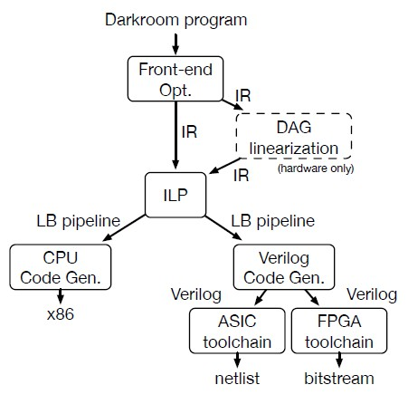

### 5.1 ASIC & FPGA synthesis

Our hardware generator implements **line buffers** as circularly addressed SRAMs or BRAMs. Each clock, a column of pixel data from the line buffer shifts into **a 2D array of registers**. The user’s image function is implemented as **combinational logic**, writing into an **output register**. 

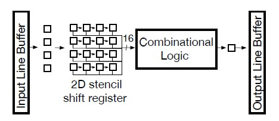

We only support programs that are **straight pipelines** with **one input, one output, and a single consumer of each intermediate**.

Image functions have **multiple inputs and multiple outputs**. In order to support these programs, we translate the Darkroom program into an equivalent Darkroom program that is a straight pipeline. **The merging of nodes** in the programs can **create larger line buffers** than what could be achieved with a hardware implementation that supported DAG pipelines. 

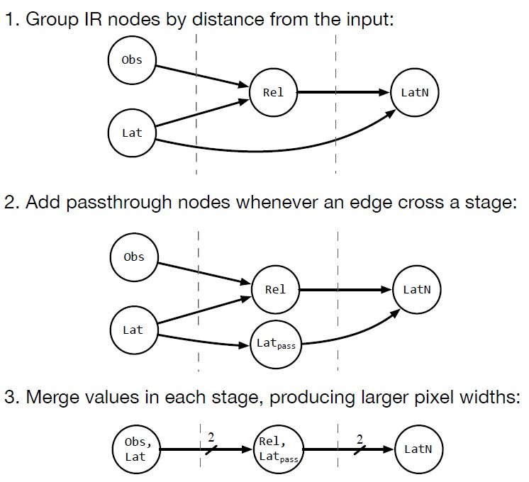

###5.2 CPU compilation

Our CPU compiler implements the line-buffered pipeline as a multi-threaded function. To enable parallelism, we **tile the output image into multiple strips** and** compute each strip** on a different core. Intermediates along strip boundaries are **recomputed**.

**Within a thread**, the code follows **the line-buffered pipeline model**. A simple approach is to **have the thread’s main loop correspond to one clock cycle of the hardware**. However, the entire set of **line buffers will often exceed** the size of the fastest level of cache. 

We found that blocking the computation at the granularity of lines improved locality for this cache. The main loop calculates one line of each stencil operation with the line buffers expanded to the granularity of lines. In addition to keeping the line buffer values in the fastest level of the cache, this blocking reduces register spills in the inner loop by reducing the number of live induction variables. A stencil stage S2 that consumes from S1 yields the following code:

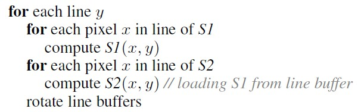

To exploit vector instructions available on modern hardware, we **vectorize the computation** within each line of each stage.
Line buffers are implemented using a small block of memory that we ensure stays in cache using the technique of Gummaraju and Rosenblum to simulate a scratchpad memory by restricting most memory access to this block and issuing non-temporal writes for our output images. We manage the modular arithmetic of the line buffers in the outer loop over the lines of an image so that each inner loop over pixels contains fewer instructions. 

## 6. Results

To evaluate Darkroom, we implemented a camera pipeline (ISP), and three possible future extensions—CORNER DETECTION, EDGE DETECTION, and DEBLUR—in hardware. 

**ISP** includes basic raw conversion operations (demosaicing, white balance, and color correction), in addition to enhancement and error correction operations (crosstalk correction, dead pixel suppression, and black level correction). Mapping ISP to Darkroom is straightforward: it is a linear pipeline of stencil operations, each of which becomes an image function.

**CORNER DETECTION** is a classic corner detection algorithm, used as an early stage in many computer vision algorithms, and implemented as a series of local stencils. 

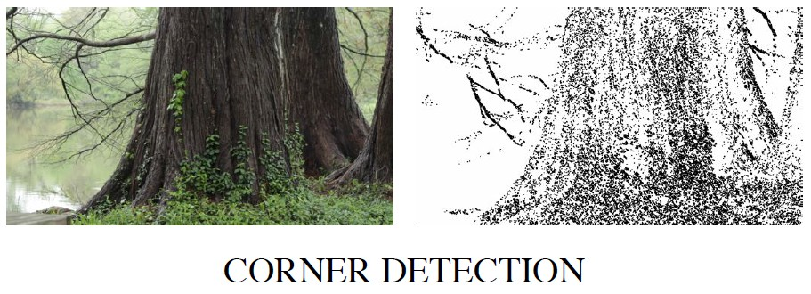

**EDGE DETECTION** is a classic edge detection algorithm. It first takes a gradient of the image in x and y, classifies pixels as edges at local gradient maxima, and finally traces along these edge pixels sequentially. To implement this algorithm in Darkroom, we adapted the classic serial algorithm into a parallel equivalent, at the expense of some wasted computation and bounded information propagation. EDGE DETECTION traditionally requires a long sequential iteration, which does not fit within the Darkroom model. Our implementation demonstrates that it is possible to work around some restrictions in our programming model, widening the range of applications we support at the cost of efficiency. 

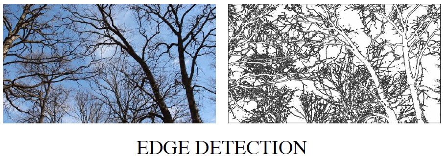

**DEBLUR** is an implementation of the Richardson-Lucy non-blind deconvolution algorithm. DEBLUR is computationally-intense iterative algorithm, which we use as a stress test of our system. We unrolled DEBLUR to 8 iterations, which was the maximum size our hardware synthesis tools could support.

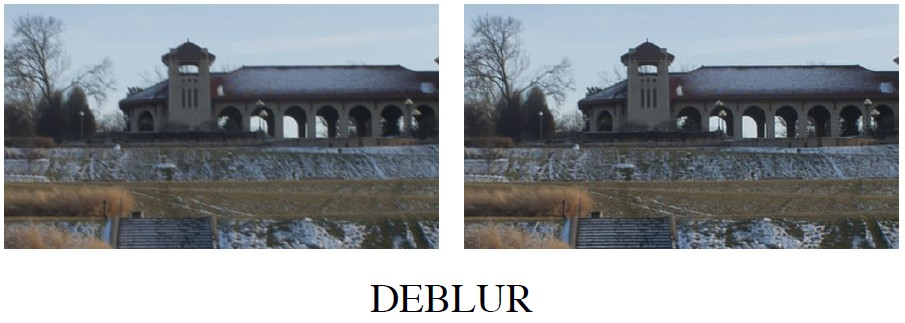

### Throughput

In ASIC, a single pipeline achieves 940-1040 megapixels/sec, enough to process 16 megapixel images at 60 FPS. On the FPGA, a single-pixel pipeline achieves 125-145 megapixels/sec, enough to process 1080p/60 in real-time (124 megapixels/sec).

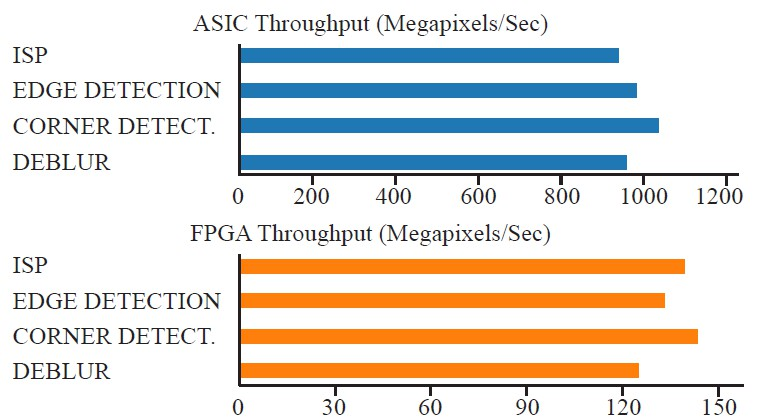

### Resource

We see that the dominant area cost is memory and logic for line buffers. The computational logic and all other overhead uses at most half the total area.

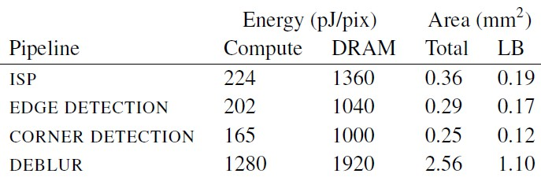

In practice, this platform provides enough resources to compile much larger pipelines, implementing multiple vision and image processing algorithms simultaneously in real-time.

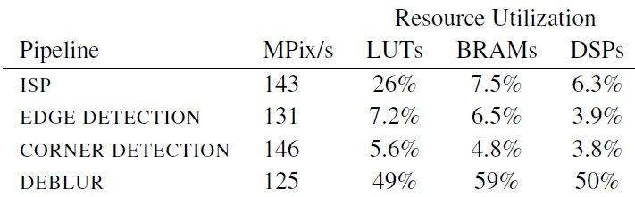

###Comparison

For ISP, we compared Darkroom to our internal reference code written as **clean C**. Our reference code has **no multithreading, vectorization, or line buffering**. Enabling these optimizations by reimplementing it in Darkroom yielded a **7x speedup**, with source code of similar complexity. Of this speedup, **3.5x comes from multithreading**, and **2x comes from vectorization**.

We also compared Darkroom to **Halide**, an existing high performance image processing language and compiler, on the DEBLUR application. We see **similar performance** from both Halideand Darkroom-compiled implementations of DEBLUR, but Darkroom’s schedule optimization takes **under 1 second** and the total **compile time** takes **less than 2 minutes**, while the Halide autotuner required **8 hours** to find a comparably performing schedule.

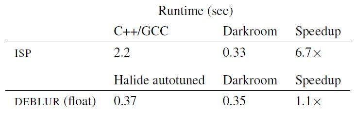

